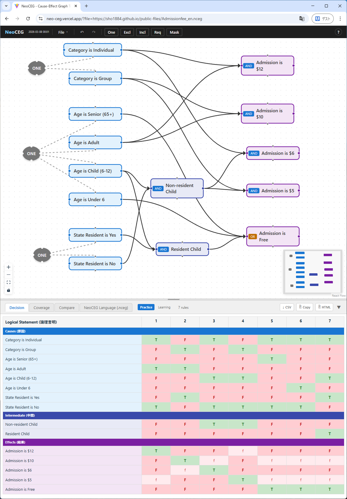
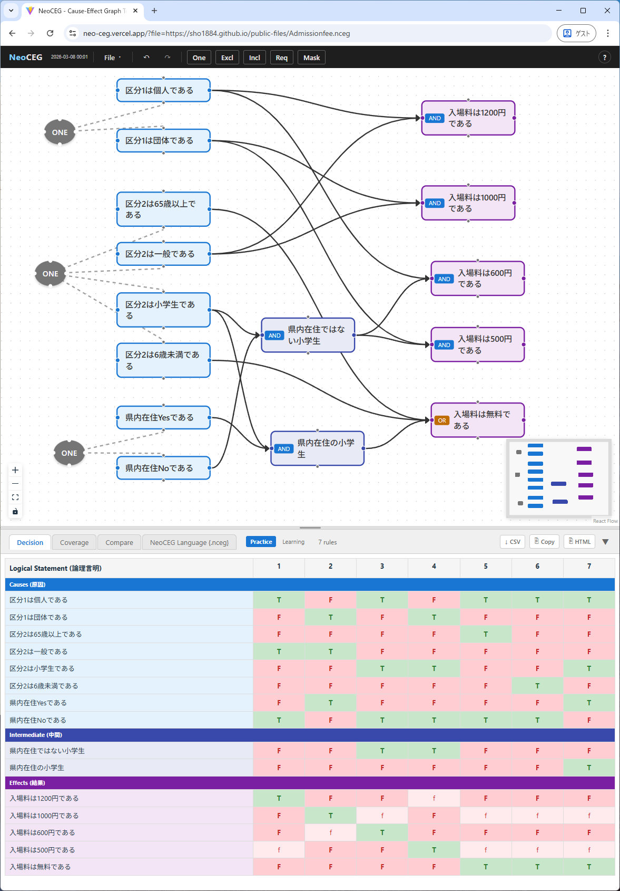

# NeoCEG

A test design tool based on the **Cause-Effect Graphing** technique (ISO/IEC/IEEE 29119-4:2021).

Draw logical and constraint relationships as a graph, and NeoCEG automatically generates an optimized **decision table** and a **coverage table** for efficient test coverage review.

**原因結果グラフ技法**（ISO/IEC/IEEE 29119-4:2021）に基づくテスト設計ツールです。

論理関係と制約関係をグラフとして描くだけで、最適化された**デシジョンテーブル**とテストの網羅性を確認できる**カバレッジ表**を自動生成します。

**Live Demo / デモ**: [neo-ceg.vercel.app](https://neo-ceg.vercel.app/)
**Documentation / ドキュメント**: [sho1884.github.io/public-files/NeoCEG](https://sho1884.github.io/public-files/NeoCEG/)





## Features / 特徴

- **Reactive GUI** — graph, DSL text, decision table, and coverage table update instantly / グラフ・DSLテキスト・デシジョンテーブル・カバレッジ表が即時連動
- **5 constraint types** / 5種の制約: ONE, EXCL, INCL, REQ, MASK
- **Bilingual UI** / 日英バイリンガルUI (English / Japanese)
- **DSL with [EBNF grammar](https://sho1884.github.io/public-files/NeoCEG/DSL_Grammar_Specification/)** — provide it to an AI assistant to generate graphs from natural language requirements / EBNF文法をAIアシスタントに渡して自然言語の要求仕様からグラフを生成
- **PWA** — installable as a standalone app from the browser / ブラウザからアプリとしてインストール可能
- **Export** / エクスポート: CSV, HTML, SVG

## Getting Started / はじめに

### Prerequisites / 前提条件

- [Node.js](https://nodejs.org/) 18 or later / 18 以降

### Install and Run / インストールと起動

```bash
git clone https://github.com/sho1884/NeoCEG.git
cd NeoCEG
npm install
npm run dev
```

Open [http://localhost:5173](http://localhost:5173) in your browser. / ブラウザで開いてください。

### Build / ビルド

```bash
npm run build
```

Output is generated in the `dist/` directory. / `dist/` ディレクトリに出力されます。

### Test / テスト

```bash
npx vitest run
```

## Tech Stack / 技術スタック

| Category / カテゴリ | Technology / 技術 |
|----------|-----------|
| UI Framework | React 19 |
| Graph Editor | React Flow (@xyflow/react) |
| State Management / 状態管理 | Zustand |
| Language / 言語 | TypeScript (strict mode) |
| Build Tool | Vite |
| Testing / テスト | Vitest |
| i18n / 国際化 | i18next |
| Deployment / デプロイ | Vercel (PWA via vite-plugin-pwa) |

## Documentation / ドキュメント

Specifications are maintained in the [`Doc/`](Doc/) directory. / 仕様書は `Doc/` ディレクトリで管理しています。

- [Requirements Specification / 要件仕様](Doc/Requirements_Specification.md)
- [GUI Specification / GUI仕様](Doc/GUI_Specification.md)
- [DSL Grammar Specification / DSL文法仕様](Doc/DSL_Grammar_Specification.md)
- [Algorithm Design / アルゴリズム設計](Doc/Algorithm_Design.md)
- [Security Design / セキュリティ設計](Doc/Security_Design.md)
- [User Manual / ユーザーマニュアル](Doc/User_Manual.md)

## Acknowledgments / 謝辞

This project owes a profound debt to **X-CEG** (Dr. Koichi Akiyama) and **CEGTest** (Masaki Kase), whose tools brought the Cause-Effect Graphing technique into practical, usable form.

本プロジェクトは、秋山浩一氏の **X-CEG** および加瀬正樹氏の **CEGTest** に多大な恩恵を受けています。両氏のツールは、原因結果グラフ技法を実用的かつ使いやすい形に具現化しました。

## License / ライセンス

[MIT](LICENSE)
